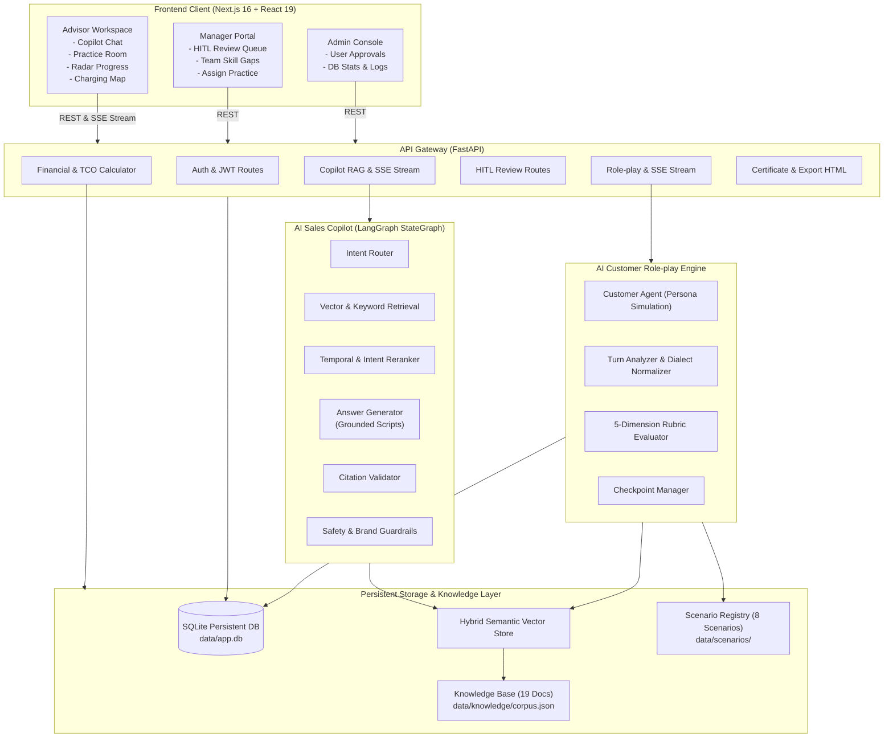

# Architecture Document — VFO2O-20 VinFast AI Sales Enablement Coach

## 1. System Overview

**VFO2O-20** là nền tảng AI Sales Enablement toàn diện dành cho tư vấn viên ô tô điện VinFast và đội ngũ quản lý đào tạo. Hệ thống kết hợp kiến trúc **RAG đa tầng nhận biết thời gian (Temporal RAG)** phục vụ tra cứu thông tin bán hàng tức thì (AI Copilot), động cơ **Mô phỏng khách hàng thích ứng (Adaptive AI Customer Role-play)** với phân tích lượt nói thời gian thực, và bộ **Chấm điểm Rubric 5 tiêu chí tự động trích dẫn bằng chứng hội thoại**, tích hợp cổng **Phê duyệt của Quản lý đào tạo (Human-in-the-Loop)**.

---

## 2. Architecture Diagram

---

## 3. Core Components

### 3.1. Frontend Application (Next.js 16 + React 19 + Tailwind CSS)
- **Advisor Workspace (`/advisor`):**
  - **Copilot Tab:** Trợ lý hỏi đáp tri thức sản phẩm, chính sách giá, ưu đãi với trích dẫn số hiệu công văn và nút sao chép câu tư vấn nhanh. Hỗ trợ Server-Sent Events (SSE) gõ chữ từng từ.
  - **Practice Room Tab:** Phòng đàm thoại thực chiến với khách hàng ảo, hiển thị thanh cảm xúc tin tưởng (`trust_level`) và mức độ quan tâm (`interest_level`), phát hiện thông tin ẩn được mở khóa. Hỗ trợ nhập liệu giọng nói (Voice Input).
  - **Session Result Tab:** Hiển thị kết quả đánh giá 5 tiêu chí Rubric, điểm số 100, bằng chứng trích dẫn trực tiếp từ lời nói của sales, lý do chấm điểm và nút in Chứng nhận đào tạo (`/certificate`).
  - **Progress Tab:** Biểu đồ mạng nhện năng lực 5 chiều (Spider Radar Chart), phân tích thế mạnh và khoảng cách kỹ năng (Skill Gap Analysis).
  - **Charging Map Tab:** Bản đồ tương tác tìm kiếm trạm sạc V-GREEN theo bán kính vị trí của khách hàng.
- **Manager Portal (`/manager`):**
  - Hàng đợi phê duyệt Human-in-the-Loop (`HITLReviewModal`), cho phép Quản lý hiệu chỉnh điểm số, thêm nhận xét sư phạm và phê duyệt chính thức.
  - Bảng tổng hợp năng lực đội ngũ tư vấn viên showroom và giao bài tập luyện tập.
- **Admin Console (`/admin`):**
  - Quản lý và phê duyệt tài khoản mới đăng ký, phân bổ vai trò và showroom.
  - Kiểm tra thống kê dữ liệu lưu trữ SQLite, độ trễ và telemetry sự kiện.

### 3.2. Knowledge Base & Ingestion Pipeline (`src/knowledge/`)
- **Metadata Contract (`src/knowledge/metadata.py`):** Schema `NormalizedDocument` chuẩn hóa 9 trường bắt buộc.
- **Chunking Engine (`src/knowledge/chunking.py`):** Chia nhỏ văn bản theo ngữ nghĩa, đoạn văn và script bán hàng (kèm `ChunkMetadata`).
- **Vector Store (`src/knowledge/vector_store.py`):** `InMemoryVectorStore` tìm kiếm hybrid (Cosine Similarity 50% + Keyword Overlap 35% + Model Matching Bonus 15%).
- **Policy Versioning (`src/knowledge/policy_versioning.py`):** Quản lý trạng thái hiệu lực văn bản bán hàng theo thời gian thực, loại bỏ tự động các văn bản hết hạn (`status == "expired"`).
- **Ingestion Pipeline (`src/knowledge/ingestion.py`):** Tự động hóa chuẩn hóa, khử trùng lặp và xác thực trước khi nạp dữ liệu.

### 3.3. AI Sales Copilot Agent (`src/copilot/`)
- **Intent Router:** Phân loại câu hỏi thành `product_specs`, `battlecard_comparison`, `battery_and_charging`, `policy_and_pricing`.
- **Reranker:** Tái chấm điểm tài liệu dựa trên độ tương thích intent và độ mới của văn bản.
- **Answer Generator:** Sinh câu trả lời có cấu trúc với dẫn chứng số liệu, kèm 3 luận điểm bán hàng (Talking Points) và 3 câu hỏi đào sâu nhu cầu (Follow-up Questions).
- **Citation Validator:** Xác minh nguồn gốc văn bản, chỉ cho phép trích dẫn văn bản còn hiệu lực.
- **Guardrails:** Chống ảo giác số liệu, bảo vệ thương hiệu và ngăn chặn ngôn từ nhạy cảm.

### 3.4. AI Customer Role-play Engine (`src/roleplay/`)
- **Customer Agent (`src/roleplay/customer_agent.py`):** Mô phỏng khách hàng tự nhiên theo 6 persona, thích ứng mức độ tin tưởng (`trust_level`) và quan tâm (`interest_level`) theo chất lượng câu trả lời của sales.
- **Turn Analyzer (`src/roleplay/turn_analyzer.py`):** Bóc tách tín hiệu hội thoại, chuẩn hóa khẩu ngữ vùng miền (Nghệ Tĩnh, Nam Bộ) và kích hoạt quy tắc hé lộ thông tin ẩn (`DisclosureRule`).
- **Rubric Session Evaluator (`src/roleplay/evaluator.py`):** Tự động chấm điểm 5 tiêu chí:
  1. `need_discovery`: Thấu hiểu nhu cầu.
  2. `product_knowledge`: Kiến thức sản phẩm.
  3. `objection_handling`: Xử lý từ chối.
  4. `policy_accuracy`: Độ chuẩn chính sách.
  5. `closing_next_step`: Kỹ năng chốt cọc lái thử.
- **Checkpoint & Persistence (`src/roleplay/checkpoint.py`, `persistence.py`):** Lưu trữ phiên liên tục vào database SQLite.

### 3.5. Financial & TCO Calculator Engine (`src/services/calculator_service.py`)
- **Loan Amortization:** Tính bảng dự trù gốc, lãi tháng đầu, tổng lãi vay ngân hàng theo dư nợ giảm dần (hỗ trợ lãi suất cố định 5%).
- **TCO Calculator:** So sánh chi phí điện + thuê pin + bảo dưỡng xe VinFast với chi phí xăng + bảo dưỡng + thuế trước bạ 10-12% của xe xăng cùng phân khúc trong 3–5 năm.

### 3.6. Persistent Database (`src/platform/database.py`)
- **Hệ cơ sở dữ liệu:** SQLite (`data/app.db`) kết nối qua SQLAlchemy 2.0.
- **Các bảng dữ liệu:**
  - `users`: Tài khoản tư vấn viên, quản lý đào tạo và admin.
  - `practice_sessions`: Phiên thực hành, kịch bản, giai đoạn hội thoại và thông tin hé lộ.
  - `session_messages`: Lịch sử từng lượt chat (customer & advisor) kèm intent.
  - `session_evaluations`: Điểm Rubric 5 tiêu chí, nhận xét AI, điểm Quản lý duyệt (HITL).
  - `telemetry_events`: Ghi nhận sự kiện hệ thống và tương tác người dùng.
  - `training_assignments`: Danh sách bài tập luyện tập do Quản lý giao cho tư vấn viên.

---

## 4. Evaluation Benchmark Metrics

Hệ thống được kiểm định tự động bằng bộ benchmark độc lập tại `eval/` (`python3 -m eval.runner`):

| Chỉ số | Mục tiêu BTC | Kết quả thực tế | Trạng thái |
|---|---|---|---|
| **Copilot Hit Rate** | > 80% | **100.0%** (25/25 câu hỏi) | ✅ Vượt trội |
| **Copilot Recall@3** | > 85% | **96.0%** | ✅ Vượt trội |
| **Citation Precision** | > 80% | **88.0%** | ✅ Đạt chuẩn |
| **Groundedness Score** | > 85% | **99.3%** | ✅ Xuất sắc |
| **Độ trễ trung bình Copilot** | < 3.0s | **0.59 ms** | ✅ Siêu tốc |
| **Lọc bỏ chính sách hết hạn** | 100% | **100.0%** | ✅ Tuyệt đối |
| **Role-play Simulation Pass** | > 90% | **100.0%** (8/8 kịch bản) | ✅ Hoàn hảo |
| **Judge MAE (1-5 Scale)** | < 0.50 | **0.24** | ✅ Lệch cực thấp |
| **Judge Agreement Rate (±1)** | > 85% | **94.0%** | ✅ Chuẩn hóa cao |
| **Unit & Integration Tests** | 100% pass | **37/37 tests PASS** | ✅ Ổn định |

---

## 5. Security & Reliability

- **Bảo mật thông tin ẩn:** `RoleplayState` ngăn chặn tuyệt đối việc rò rỉ `hidden_facts` cho tư vấn viên xem trước thông qua hàm `advisor_visible_context()`.
- **Cơ chế Fallback:** Bộ vector embedding và sinh phản hồi có cơ chế deterministic fallback tại chỗ, đảm bảo hệ thống hoạt động 100% khi chạy offline không có mạng hoặc khi API ngoài bị gián đoạn.
- **Xác thực JWT:** Token HS256 có thời hạn 8 giờ, mã hóa một chiều mật khẩu bằng SHA-256.
