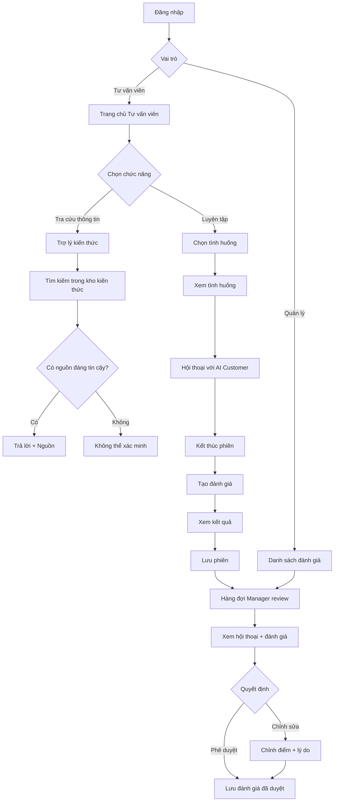

# Wireframe / Luồng giao diện MVP

## 1. Kiến trúc thông tin MVP

### Tư vấn viên bán hàng

```text
Trang chủ
├── Bắt đầu luyện tập
├── Hỏi Trợ lý kiến thức
└── Phiên luyện tập gần đây

Luyện tập
├── Chọn tình huống
├── Phòng luyện tập
└── Kết quả phiên luyện tập

Kiến thức
└── Trợ lý kiến thức
```

### Quản lý đào tạo

```text
Đánh giá
├── Đánh giá đang chờ
└── Xem chi tiết đánh giá
```

---

# 2. Đăng nhập

```text
┌────────────────────────────────────────────┐
│               SALES COACH                  │
│                                            │
│ Email                                      │
│ ┌────────────────────────────────────────┐ │
│ │                                        │ │
│ └────────────────────────────────────────┘ │
│                                            │
│ Mật khẩu                                   │
│ ┌────────────────────────────────────────┐ │
│ │                                        │ │
│ └────────────────────────────────────────┘ │
│                                            │
│               [ Đăng nhập ]                │
└────────────────────────────────────────────┘
```

Sau khi đăng nhập:

```text
Tư vấn viên bán hàng  → Trang chủ tư vấn viên
Quản lý đào tạo       → Danh sách đánh giá
```

---

# 3. Trang chủ Tư vấn viên

```text
┌─────────────┬─────────────────────────────────────────────┐
│ Sales Coach │ Xin chào                                   │
│             │                                             │
│ ● Trang chủ │ ┌──────────────────┐ ┌───────────────────┐ │
│   Luyện tập │ │ BẮT ĐẦU          │ │ HỎI TRỢ LÝ        │ │
│   Kiến thức │ │ LUYỆN TẬP        │ │ KIẾN THỨC         │ │
│             │ │                  │ │                   │ │
│             │ │ [Bắt đầu]        │ │ [Đặt câu hỏi]     │ │
│             │ └──────────────────┘ └───────────────────┘ │
│             │                                             │
│             │ Phiên luyện tập gần đây                     │
│             │ Tình huống A       78        20/09         │
│             │ Tình huống B       82        18/09         │
└─────────────┴─────────────────────────────────────────────┘
```

Trang chủ MVP chỉ cần trả lời hai câu hỏi:

```text
Tôi muốn luyện tập?

Tôi cần tra cứu thông tin?
```

---

# 4. Trợ lý kiến thức

Trợ lý kiến thức hỗ trợ tư vấn viên tra cứu nhanh các thông tin như:

```text
Sản phẩm
Thông số xe
Giá bán
Chính sách
Ưu đãi
Bảo hành
Pin / sạc
```

Giao diện:

```text
┌─────────────┬─────────────────────────────────────────────┐
│             │ Trợ lý kiến thức                           │
│             │                                             │
│             │ Hỏi về sản phẩm, giá hoặc chính sách      │
│             │                                             │
│             │ ┌─────────────────────────────────────────┐ │
│             │ │ Chính sách ... hiện tại như thế nào?   │ │
│             │ └─────────────────────────────────────────┘ │
│             │                                             │
│             │ AI                                          │
│             │ ┌─────────────────────────────────────────┐ │
│             │ │ Theo nguồn hiện tại...                 │ │
│             │ │                                         │ │
│             │ │ Nguồn                                   │ │
│             │ │ [Chính sách tháng 09/2026]             │ │
│             │ └─────────────────────────────────────────┘ │
│             │                                             │
│             │ ┌─────────────────────────────────────────┐ │
│             │ │ Hỏi câu khác...                        │ │
│             │ └─────────────────────────────────────────┘ │
└─────────────┴─────────────────────────────────────────────┘
```

Nếu không tìm được nguồn đủ tin cậy:

```text
Tôi chưa thể xác minh thông tin này
từ kho kiến thức hiện tại.
```

Khi bấm vào nguồn:

```text
Tài liệu
Phiên bản / Ngày
Đoạn nội dung liên quan
Liên kết nguồn gốc
```

Knowledge corpus được team chuẩn bị sẵn từ các nguồn chính thức trước khi chạy hệ thống.

---

# 5. Chọn tình huống luyện tập

MVP sử dụng một số tình huống cố định được chuẩn bị sẵn.

```text
┌───────────────────────────────────────────────┐
│ Chọn tình huống luyện tập                     │
│                                               │
│ ○ Tình huống A                                │
│ ○ Tình huống B                                │
│ ○ Tình huống C                                │
│ ○ Tình huống D                                │
│                                               │
│ Độ khó: Dễ / Trung bình                       │
│                                               │
│              [ Bắt đầu phiên ]                │
└───────────────────────────────────────────────┘
```

Sau khi chọn:

```text
┌───────────────────────────────────────────────┐
│ Tình huống A                                  │
│                                               │
│ Khách hàng                                    │
│ • Thông tin cơ bản về khách hàng              │
│                                               │
│ Mục tiêu của bạn                              │
│ • Thực hiện cuộc tư vấn                       │
│                                               │
│ Các kỹ năng luyện tập                         │
│ • Kỹ năng 1                                   │
│ • Kỹ năng 2                                   │
│ • Kỹ năng 3                                   │
│                                               │
│                  [ Bắt đầu ]                   │
└───────────────────────────────────────────────┘
```

Không hiển thị cho tư vấn viên:

```text
Thông tin ẩn của khách hàng
Logic chấm điểm nội bộ
Quy tắc tiết lộ thông tin của khách hàng
Prompt nội bộ của AI Customer
```

---

# 6. Phòng luyện tập

AI đóng vai khách hàng và hội thoại nhiều lượt với tư vấn viên.

```text
┌─────────────────┬─────────────────────────────────────────┐
│ KHÁCH HÀNG      │ Phiên luyện tập                         │
│                 │                                         │
│ Khách hàng A    │ 👤 Khách hàng                           │
│                 │ "Tôi đang cân nhắc nhưng..."           │
│ Thông tin       │                                         │
│ • mua xe gia đình│                      Bạn               │
│ • có băn khoăn  │ "..."                                   │
│                 │                                         │
│                 │ 👤 Khách hàng                           │
│                 │ "..."                                   │
│                 │                                         │
│                 │ ┌─────────────────────────────────────┐ │
│                 │ │ Nhập câu trả lời...                │ │
│                 │ └─────────────────────────────────────┘ │
│                 │                           [Gửi]         │
│                 │                                         │
│                 │              [ Kết thúc luyện tập ]     │
└─────────────────┴─────────────────────────────────────────┘
```

AI Customer phải:

```text
Nhớ lịch sử hội thoại
Giữ đúng vai và tính cách khách hàng
Phản ứng dựa trên câu trả lời trước của tư vấn viên
Tiết lộ thông tin dần dần
Giữ tính nhất quán của tình huống
```

Không hiển thị điểm trong lúc hội thoại.

---

# 7. Kết quả phiên luyện tập

Sau khi kết thúc:

```text
Phiên luyện tập đã kết thúc

Đang phân tích cuộc hội thoại...
```

Sau đó:

```text
┌──────────────────────────────────────────────────────────┐
│ KẾT QUẢ PHIÊN LUYỆN TẬP                                 │
│                                                          │
│ Tổng điểm                              78 / 100           │
│                                                          │
│ Kỹ năng 1                             4 / 5               │
│ Kỹ năng 2                             3 / 5               │
│ Kỹ năng 3                             4 / 5               │
│                                                          │
│ ĐIỂM LÀM TỐT                                            │
│ ✓ Ví dụ bằng chứng tại lượt hội thoại 4                 │
│                                                          │
│ CẦN CẢI THIỆN                                           │
│ ⚠ Ví dụ bằng chứng tại lượt hội thoại 8                 │
│                                                          │
│ Gợi ý cải thiện                                          │
│ Feedback ngắn từ hệ thống                                │
│                                                          │
│                        [ Luyện tập lại ]                  │
└──────────────────────────────────────────────────────────┘
```

Nếu feedback liên quan đến thông tin sản phẩm hoặc chính sách:

```text
Nguồn tham chiếu
[Xem nguồn]
```

Tên và định nghĩa cụ thể của từng kỹ năng sẽ được xác định sau.

---

# 8. Quản lý — Danh sách đánh giá đang chờ

```text
┌─────────────┬─────────────────────────────────────────────┐
│ Quản lý     │ Đánh giá đang chờ                          │
│             │                                             │
│ ● Đánh giá │ Tư vấn viên A   Tình huống A   [Xem]       │
│             │ Tư vấn viên B   Tình huống B   [Xem]       │
│             │ Tư vấn viên C   Tình huống C   [Xem]       │
└─────────────┴─────────────────────────────────────────────┘
```

---

# 9. Quản lý — Xem đánh giá

Manager xem transcript và kết quả AI tạo.

```text
┌──────────────────────────────────────────────────────────┐
│ Đánh giá — Tư vấn viên A                                 │
│                                                          │
│ Hội thoại                  Đánh giá AI                    │
│ ┌──────────────────────┐   ┌───────────────────────────┐ │
│ │ Lượt 1               │   │ Kỹ năng 1          4/5   │ │
│ │ Lượt 2               │   │ Kỹ năng 2          3/5   │ │
│ │ ...                  │   │ Kỹ năng 3          4/5   │ │
│ └──────────────────────┘   │                           │ │
│                            │ Bằng chứng: Lượt 4, 8     │ │
│                            └───────────────────────────┘ │
│                                                          │
│ [ Phê duyệt ]                  [ Chỉnh sửa ]              │
└──────────────────────────────────────────────────────────┘
```

Nếu Manager chỉnh sửa:

```text
Điểm AI:          3
Điểm quản lý:     [4]

Lý do:
[____________________________]

[Lưu]
```

Hệ thống lưu:

```text
Đánh giá ban đầu của AI
Thay đổi của Manager
Lý do chỉnh sửa
Thời gian chỉnh sửa
```

---

# 10. Luồng MVP tổng thể



---

# 11. Tóm tắt phạm vi MVP

## Tư vấn viên bán hàng

```text
Đăng nhập
Tra cứu bằng Trợ lý kiến thức
Chọn tình huống luyện tập
Hội thoại nhiều lượt với AI Customer
Xem kết quả phiên luyện tập
Xem các phiên gần đây
```

## Quản lý đào tạo

```text
Xem các đánh giá đang chờ
Xem hội thoại và đánh giá của AI
Phê duyệt / chỉnh sửa đánh giá
Thêm ghi chú khi cần
```

## Backend

```text
RAG + trích dẫn nguồn
Metadata / version tài liệu
Bộ nhớ hội thoại nhiều lượt
AI Customer
Tạo đánh giá sau phiên luyện tập
Lưu kết quả Manager review
Knowledge corpus được team chuẩn bị sẵn
```

---

# 12. Chưa cần trong MVP

Các chức năng sau chuyển sang giai đoạn sau:

```text
Tự động đề xuất bài luyện tập cá nhân hóa
Dashboard xu hướng kỹ năng
Phân tích toàn đội
Know-vs-Do Matrix
Tự động crawl chính sách hằng ngày
Certification
Dashboard Manager phức tạp
```

MVP chỉ cần chứng minh ba giá trị chính:

```text
1. Tư vấn viên có thể tra cứu thông tin
   có căn cứ và có nguồn.

2. Tư vấn viên có thể luyện tập
   với AI Customer qua hội thoại nhiều lượt.

3. Manager có thể kiểm tra, phê duyệt
   hoặc chỉnh sửa feedback do AI tạo.
```
